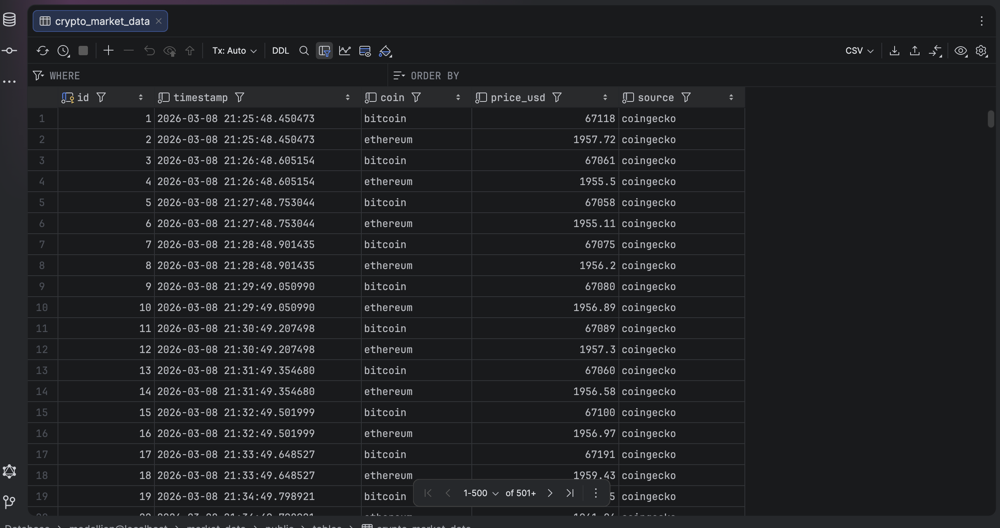
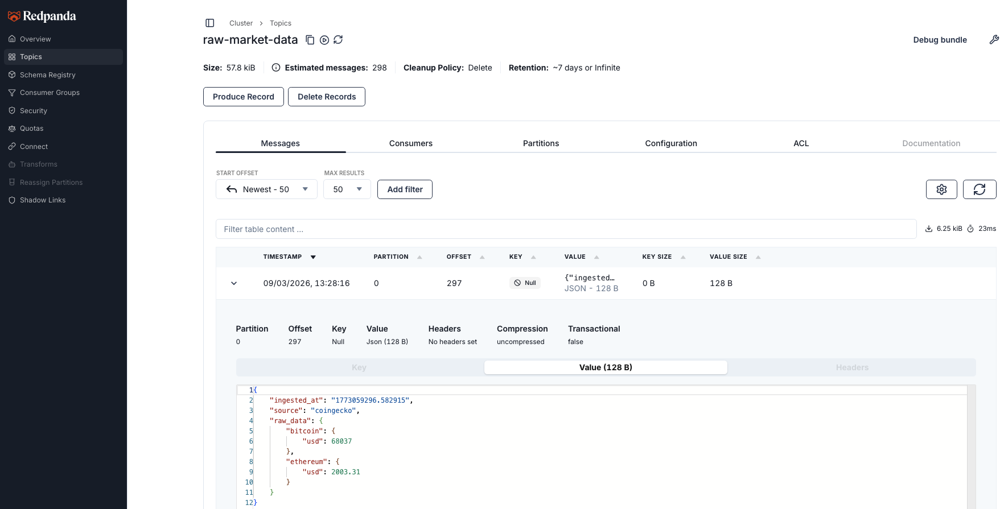
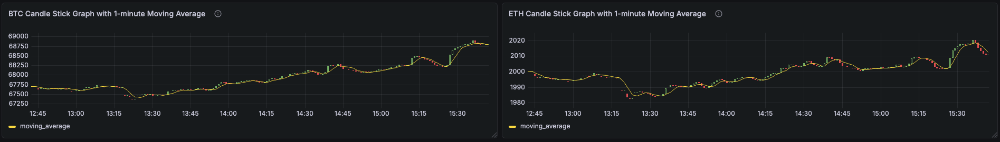
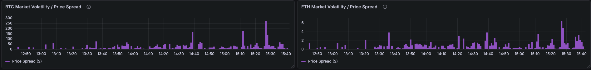
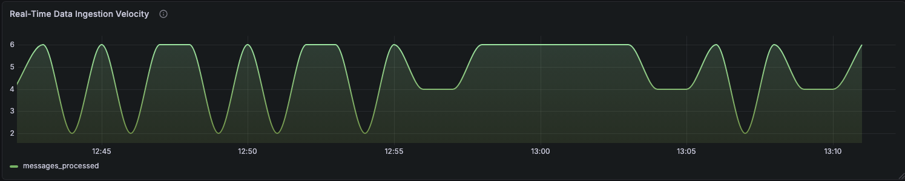
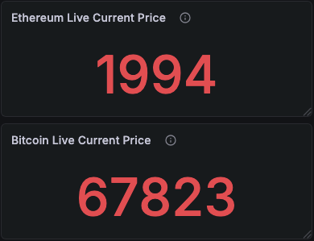
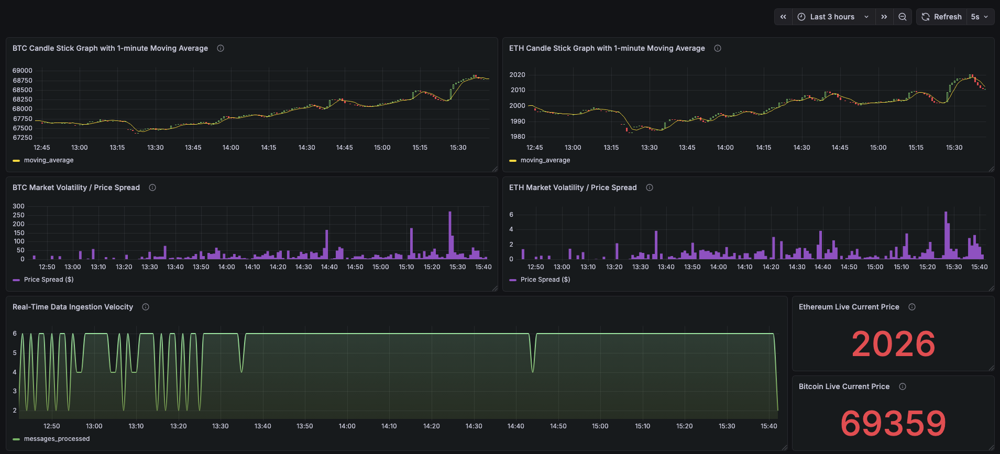

# Streaming Medallion Architecture

> An end-to-end, real-time data streaming and processing pipeline demonstrating the **Medallion Architecture** (Bronze, Silver, Gold). Built to handle continuous data flows, it ingests live cryptocurrency market data, streams it through a message broker, transforms it into a relational schema, and calculates real-time business aggregations.

## Architecture & Tech Stack

- **Data Source:** CoinGecko Public API (Live BTC & ETH prices)
- **Message Broker:** Redpanda (Lightweight, Kafka-compatible)
- **Processing & Orchestration:** Python, FastAPI, Pydantic, Docker Compose
- **Storage & Transformations:** PostgreSQL 15, SQLAlchemy ORM

---

## Pipeline Stages

### Bronze Layer (Raw Ingestion)

The producer (`producer/main.py`) runs an asynchronous FastAPI background task that fetches live data from the CoinGecko API.

- **Engineering Detail:** The producer utilizes `asyncio.sleep()` with a configurable interval (default: 5 minutes) to throttle ingestion, respecting the public API rate limits while ensuring a continuous stream. Raw JSON payloads are pushed to the `raw-market-data` Redpanda topic.
- **Retry Logic:** Failed API calls are automatically retried up to 3 times with a 5-second delay between attempts, using `response.raise_for_status()` to catch non-200 responses.
- **API Endpoints:** `POST /start` to begin streaming, `POST /stop` to halt it, and `GET /next_fetch_time` to check when the next API call is scheduled.

### Silver Layer (Cleansed & Conformed)

The consumer (`consumer/main.py`) subscribes to the Redpanda topic, acting as an infinite stream processor.

- **Engineering Detail:** It deserializes the raw JSON and uses **Pydantic** for strict schema validation. Valid records are flattened, strictly typed, and loaded into the `crypto_market_data` PostgreSQL table via SQLAlchemy.
- **Fault Tolerance (DLQ):** If malformed data or a "poison pill" enters the stream, the validation layer catches it and gracefully routes the broken payload to a separate `dead-letter-queue` topic, ensuring the main pipeline never crashes.

### Gold Layer (Business Aggregations)

The presentation layer is handled natively within PostgreSQL for maximum query performance.

- **Engineering Detail:** A Python setup script (`gold_layer/setup_views.py`) programmatically executes DDL to create the `crypto_market_metrics` view. This view leverages SQL's `date_trunc` to calculate real-time, 1-minute tumbling window metrics (moving average, high, low, and data point counts) directly from the Silver table.

---

## Project Structure

```
├── producer/
│   ├── main.py          # FastAPI app & streaming logic
│   └── config.py        # Producer-specific config
├── consumer/
│   ├── main.py          # Kafka consumer & processing loop
│   ├── db.py            # Database engine & session setup
│   ├── models.py        # SQLAlchemy models
│   └── schemas.py       # Pydantic validation schemas
├── gold_layer/
│   └── setup_views.py   # SQL view creation script
├── shared/
│   └── __init__.py      # Shared Kafka config
├── test/
│   └── test_dlq.py      # DLQ poison message test
├── docker-compose.yml
├── requirements.txt
└── .env
```

---

## 🚀 Quick Start Guide

Follow these steps to clone the repository, set up your environment, and run the complete Medallion Architecture pipeline locally.

### Prerequisites

- **Docker & Docker Compose** installed and running
- **Python 3.9+**
- **Git**

---

### 1. Clone the Repository & Start Infrastructure

First, fetch the code and spin up the required database and message broker containers.

```bash
# Clone the repository
git clone https://github.com/your-username/streaming-medallion-architecture.git
cd streaming-medallion-architecture

# Copy the environment file and configure it
cp .env.sample .env

# Start Redpanda and PostgreSQL in the background
docker-compose up -d
```

### 2. Set Up the Python Environment

Create an isolated virtual environment and install the required dependencies (FastAPI, Kafka-Python, SQLAlchemy, etc.).

```bash
# Create and activate the virtual environment
python -m venv venv
source venv/bin/activate

# Install dependencies
pip install -r requirements.txt
```

## 3. Execute the Pipeline Layers

Because this is a real-time streaming architecture, you will need to open multiple terminal windows to run the components simultaneously.

> **Important:** Ensure your virtual environment is activated (`source venv/bin/activate`) in every new terminal window you open!

---

### Step 3A: Start the Bronze Layer (Producer)

Open **Terminal 1** and start the FastAPI data ingestion service:

```bash
uvicorn producer.main:app --reload
```

To trigger the continuous data stream, open a quick new tab and run:

```bash
curl -X POST http://127.0.0.1:8000/start
```

### Step 3B: Start the Silver Layer (Consumer)

Open **Terminal 2** and start the stream processor:

```bash
python -m consumer.main
```

### Step 3C: Set Up the Gold Layer (Aggregations)

Open **Terminal 3** and run the setup script to build the business metrics view:

```bash
python -m gold_layer.setup_views
```

### 4. Relational Data Persistence (PostgreSQL Silver Layer)

Once messages are consumed from Redpanda and validated via Pydantic, they are persisted into a PostgreSQL database. This "Silver Layer" serves as the source of truth for all downstream analytical queries and BI dashboards.



- **Table Name:** `crypto_market_data`
- **Schema Design:** Includes fields for UUID, coin identifier, price in USD, and high-precision timestamps.
- **Data Integrity:** Primary keys and timestamp indexing are utilized to ensure performant queries even as the dataset grows.

### 5. Message Broker Orchestration (Redpanda)

This project uses **Redpanda**, a high-performance, Kafka-compatible message broker, to decouple the data producer from the consumer. This ensures the system remains fault-tolerant and can handle spikes in data volume.



- **Topic:** `raw-market-data`
- **Purpose:** Acts as the Bronze Layer entry point, receiving raw JSON payloads from the FastAPI producer.
- **Monitoring:** The Redpanda Console provides real-time visibility into partition health, consumer offsets, and message throughput.

## 6. Business Intelligence & Observability (Grafana)

To visualize the real-time aggregations and monitor system health, this project includes a pre-configured Grafana dashboard that connects directly to the PostgreSQL Gold layer.

### Accessing Grafana

1. Open your web browser and navigate to `http://localhost:3000`.
2. Log in with the credentials from your `.env` file:
   - **Username:** `GRAFANA_ADMIN_USER`
   - **Password:** `GRAFANA_ADMIN_PASSWORD`

### Connecting the Data Source

1. In the left-hand menu, navigate to **Connections** > **Data Sources** > **Add data source**.
2. Select **PostgreSQL** and configure the connection:
   - **Host:** `postgres:5432` _(Connects via Docker's internal network)_
   - **Database:** `market_data`
   - **User:** `<user_as_per_env>`
   - **Password:** `<password_as_per_env>`
   - **TLS/SSL Mode:** `disable`
3. Click **Save & test** to verify the connection.

### Importing the Dashboard

To view the complete Medallion Architecture visualizations without recreating the panels manually:

1. In the left-hand menu, click the **+** icon and select **Import**.
2. Click **Upload JSON file** and select the `grafana/dashboard.json` file located in this repository.
3. Select your PostgreSQL database in the data source dropdown at the bottom.
4. Click **Import**.

> **Note:** Depending on your local Grafana configuration, you may need to force an initial data fetch after importing. If the panels appear empty, simply click the three dots in the top right of any panel, select **Edit**, and hit the blue **Run query** button to render the data.

You will instantly see the real-time trading terminals, 1-minute window moving averages, volatility spreads, and pipeline ingestion velocity metrics.

## 6. Business Intelligence & Observability (Grafana)

This project includes a pre-configured Grafana dashboard that connects directly to the PostgreSQL Gold layer. It is designed to serve both technical operators monitoring system health and business stakeholders analyzing market trends.

### Dashboard Panels & Analytical Insights

#### 1. Price Trend & Momentum (Candlestick & Moving Average)



- **Technical:** Visualizes real-time Open, High, Low, and Close (OHLC) price action in 1-minute tumbling windows. Overlaid with a 5-minute rolling Simple Moving Average (SMA). Powered by Gold Layer PostgreSQL aggregations utilizing `array_agg()` and advanced window functions.
- **Business Application:** This chart identifies core market momentum. While raw price feeds are chaotic, the 5-minute Simple Moving Average (SMA) smooths out micro-fluctuations. This allows analysts and automated algorithms to quickly confirm if the asset is in a sustained bullish or bearish trend.

#### 2. Risk Assessment (Market Volatility / Price Spread)



- **Technical:** Calculates the absolute dollar spread (`MAX` - `MIN` price) within every 60-second ingestion window.
- **Business Application:** Measures immediate market instability and risk. A widening spread indicates chaotic trading conditions and low liquidity, which could trigger automated risk-management halts or identify high-margin arbitrage opportunities. A flat or narrow spread indicates market consolidation.

#### 3. Vendor SLA & Data Trust (Ingestion Velocity)



- **Technical:** System Health Metric monitoring real-time pipeline throughput. Displays the exact number of Redpanda messages that successfully passed Pydantic schema validation and were persisted to the PostgreSQL Silver Layer per minute.
- **Business Application:** Data is only valuable if it is reliable. This metric acts as a live Service Level Agreement (SLA) monitor for the upstream data vendor. By proving the data flow is continuous, we guarantee to stakeholders that the financial metrics are fresh and trustworthy.

#### 4. Executive Snapshot (Live Current Price)

<p align="center">
  
</p>

- **Technical:** Executive KPI retrieving the absolute latest timestamped record from the Silver Layer database. Acts as a real-time pulse check for the data source connection.
- **Business Application:** The ultimate top-line KPI. It provides executives, portfolio managers, and stakeholders with an instant, zero-friction snapshot of current market reality before diving into deeper historical analysis.

### The Complete Observability Platform



**Summary of Architecture Value:**
This unified view demonstrates the successful end-to-end implementation of the streaming pipeline. It proves that raw data can be reliably ingested from an external API, processed through a message broker, validated for schema integrity, and aggregated in real-time to drive immediate, actionable business intelligence.
